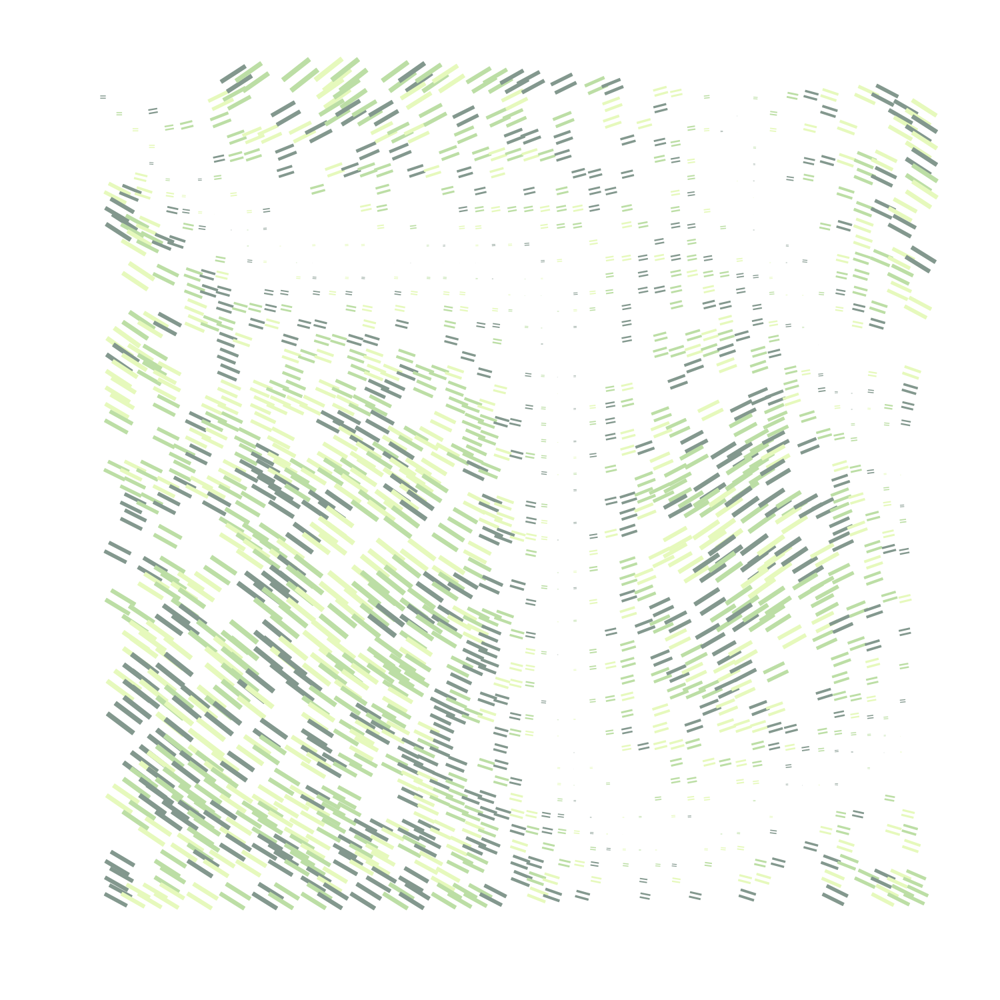

# Creative-Coding
Repo for creative coding projects with Canvas &amp; WebGL

## Installation

Clone the repo:

`git clone https://github.com/akshit0201/Creative-Coding.git`

Move into the directory:

`cd Creative-Coding`

Install dependencies:

`npm install`

Incase you don't have npm installed, checkout [npm](https://docs.npmjs.com/downloading-and-installing-node-js-and-npm).

Finally, run one of the three scripts ([shader.js](https://github.com/akshit0201/Creative-Coding/blob/main/shader.js),[sketch.js](https://github.com/akshit0201/Creative-Coding/blob/main/sketch.js) or [webgl.js](https://github.com/akshit0201/Creative-Coding/blob/main/webgl.js)) using [`canvas-sketch`](https://github.com/mattdesl/canvas-sketch.git):

`canvas-sketch sketch.js`

## sketch.js

[Sketch.js](https://github.com/akshit0201/Creative-Coding/blob/main/sketch.js) uses [`canvas-sketch`](https://github.com/mattdesl/canvas-sketch.git) to generate randomized 2D art. Additional functions like `lerp` & `palettes` are used to make the grid & impart different colors.

## webgl.js

[Webgl.js](https://github.com/akshit0201/Creative-Coding/blob/main/webgl.js)) uses [three.js](https://threejs.org/) to create immersive 3D visulatizatons. The results are in the [3Dresults](3Dresults) folder. npm's `bezier-easing` & `eases` libraries are used for adding smooth animations.

## shader.js

[Shader.js](shader.js) uses `glsl` to create shaded animations. The results of the shader are shown in the [shader](shader) folder. 
